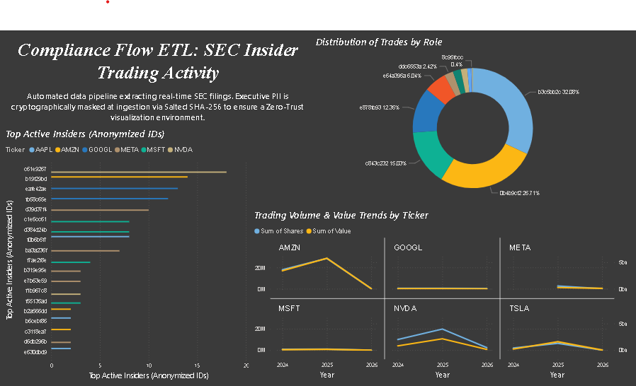

# Compliance Flow ETL: SEC Insider Trading Pipeline

## Overview
**Compliance Flow ETL** is a production-grade data engineering pipeline designed to ingest high-sensitivity SEC Insider Trading disclosures while maintaining 100% PII (Personally Identifiable Information) security through automated masking and validation.

## Tech Stack
* **Language:** Python 3.10 (Pandas, Hashlib)
* **API:** yfinance
* **Orchestration:** GitHub Actions
* **Visualization:** Power BI
* **License:** MIT

## Pipeline Architecture
This system implements a "Defensive Anonymization" pattern:
1. **Extraction:** Real-time executive trading data is pulled from the Yahoo Finance API.
2. **Cryptographic Masking:** Identities are transformed using **Salted SHA-256 Hashing** at the point of ingestion to prevent rainbow table attacks.
3. **Automated Unit Testing:** A built-in integrity check scans the final dataset to ensure zero raw PII leakage.
4. **Data Quality Gate:** The CI/CD pipeline validates file size and presence before committing to the repository.

## Design Philosophy: The Zero-Trust Bridge (Security Layer)
This project intentionally masks public SEC data to demonstrate a Production-Gate Architecture. In modern FinTech, data must be anonymized before it reaches the visualization layer to satisfy GDPR and CCPA requirements. By treating public data as 'Sensitive,' this pipeline serves as a blueprint for handling internal proprietary data.

The core innovation of this pipeline is the **Salted Deterministic Anonymization**:
* **The Problem:** Simple hashing (like MD5) is vulnerable to "Rainbow Table" attacks where hackers pre-calculate hashes for common names (like "Elon Musk") to de-anonymize the data.
* **The Solution:** We implement a Salted SHA-256 hash. By injecting a secret "Salt" (a random string) into the name before hashing, we ensure that even if two people have the same name, or if the hashing algorithm is known, the IDs are impossible to reverse-engineer without the secret key.
* **The Result:** You can share high-value behavioral data across departments or with third-party vendors without ever exposing the legal identity of the individuals.

## The Orchestrated ETL Lifecycle (Data Engineering)
This project uses GitHub Actions as a lightweight, serverless orchestrator.
* **State Management:** The pipeline is designed to be Idempotent. No matter how many times it runs, it won't create duplicate "Masked IDs" for the same person because the hash is deterministic (the same input always produces the same output).
* **Environment Parity:** By using a .yml workflow with a specific Node.js and Python runtime, we ensure that "it works on my machine" translates perfectly to "it works in the cloud."
* **Data Quality Gates:** The Python script includes validation checks to ensure that if the SEC API returns an empty set or a 404 error, the pipeline gracefully exits rather than overwriting your clean Power BI data with "trash."

## Predictive Labeling & ML Readiness (Future State)
This is where the project moves from Descriptive (what happened) to Predictive (what will happen).
* **Temporal Feature Engineering:** By capturing the Trade Date, we can create a "Time-Since-Last-Trade" feature. High-frequency trading by an insider often signals a different intent than a single large trade once a year.
* **The Target Variable:** In Phase 2, we fetch the stock price at T+30 (30 days after the trade). We calculate the Delta: ΔP = (Price at T+30 - Price at T) / (Price at T).
* **Classification:** If ΔP > 0.05 (a 5% gain), we label that trade as a "Lead Signal." Our future Machine Learning model (XGBoost or Random Forest) will then learn to identify the specific masked IDs whose trades most often result in a "Lead Signal."

## Visualization Strategy (Business Intelligence)
The Power BI dashboard uses a Star Schema approach even with a flat file.
* **Visual Hierarchy:** The dashboard is designed to be read from top-left to bottom-right. It starts with the "Macro" view (Total Roles) and ends with the "Micro" view (Specific Ticker trends).
* **Cognitive Load Management:** By using Top N Filters and Truncated Hashes (8 characters), we reduce "Chart Junk," allowing the user to focus on the shape of the data rather than struggling to read long strings of text.
